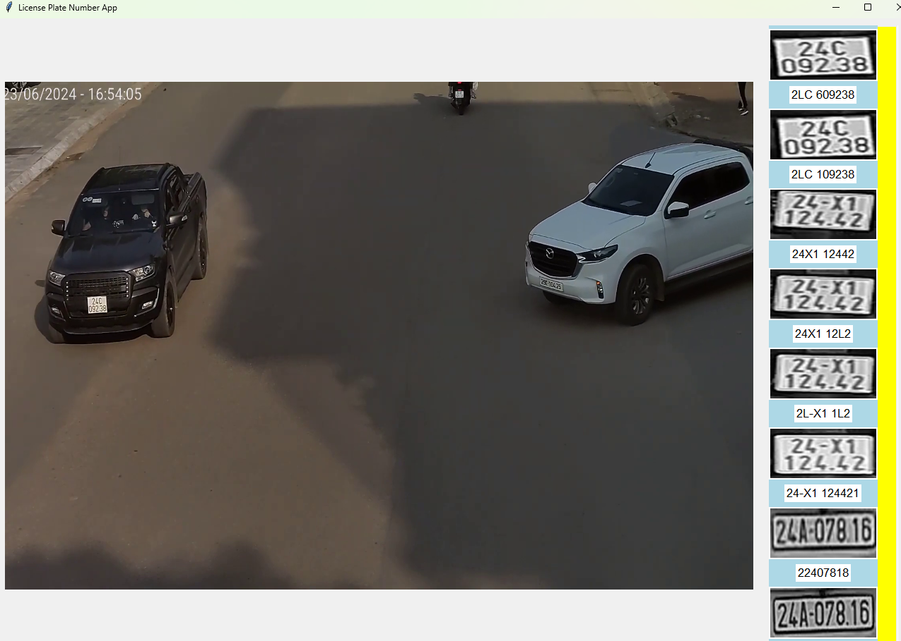

Real-time License Plate Recognition System
Technologies: Python, OpenCV, YOLOv8, EasyOCR, SQLite, Tkinter

Developed a real-time license plate recognition system using YOLOv8 for vehicle and plate detection and EasyOCR for text recognition.
Implemented BYTETracker for multi-object tracking, ensuring consistent license plate identification across frames.
Designed a Tkinter-based GUI to display real-time video streams and recognized license plates in a scrollable panel.
Optimized OCR accuracy through image preprocessing techniques (grayscale conversion, resizing, noise reduction).
Stored detected license plate numbers and images in an SQLite database for efficient retrieval.
Utilized multithreading to handle video processing and GUI updates seamlessly without lag.

Train : 

Val : 

